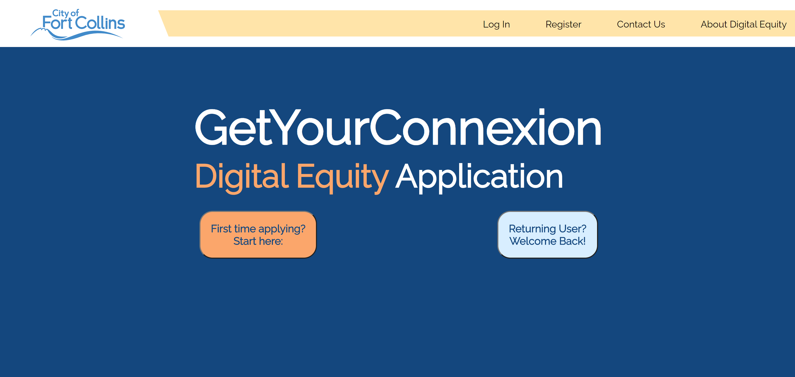
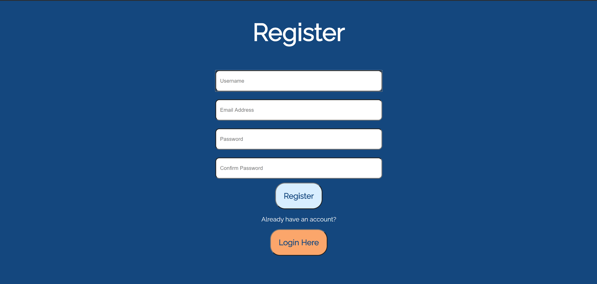
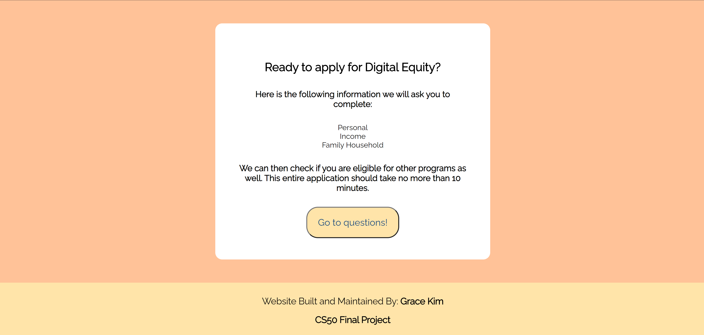

# GetYourConnexion
### **Grace Kim** - 2020 Fall CS50 Final Project

## What is GetYourConnexion?
GetYourConnexion is a online application aiming to help simplify the process of applying to income-qualifying rebate programs for residents in the City of Fort Collins, CO. This website will mainly focus on the application for digital equity, a broadband service provided at a reduced price for residents with financial struggles. While collecting the data for eligibility for digital equity, I also used this data to inform the user of their eligiblity of several other rebate programs available in the city.

### How to run this Web App
This web application can be run either locally on your desktop or laptop (I personally used VSCode for my IDE) or be run through this specific URL on pythonAnywhere. If you are running this locally, make sure you have anaconda (if you're a Windows user) or the most up to date python libraries on your computer. There are several other libraries you can also pip install from the `requirements.txt` file if you need them to run the django app.

When running this locally on your laptop, you need to do several things before launching the application. First, make sure you are cd'ed into the first `\frontend` directory (just one above the `\getYourConnexionFrontEnd` directory). Then, write these following lines within your command prompt:

1. `python manage.py makemigrations`
2. `python manage.py migrate`
3. `python manage.py runserver`

The first two commands will create the proper database migrations we need to run this program, and the third command creates the actual server that runs our application on our local address. Your local address number should be something like: `http://127.0.0.1:8000/`. 

Now when you  first open the app, you should be directed to the inital greeting page; let me explain the flow of this website in the next section.

## Outline of the Web-App

- User registration, login and logout portals
- Application for Digital Equity
- Homepage dashboard for user

### User registration, login, logout portals
When you first enter the site, you should see that there is an option to login, or register as a new user. You could also probably check out the other two links up at the top, the Contact us or About Digital Equity pages if you'd like :D. But at this current stage, since you don't have an account yet, you will need to go through the register as a new user portion in order to create an account and application for the digital equity applciation. 

### Application for Digital Equity
After registering as a new user, you will be automatically redirected to the application for digital equity. This is a short survey that should take less than 5 minutes, and it collects personal information as well as some income qualifiers as well. 

### Homepage Dashboard for User
Completing that survey with a final submission then brings you to the homepage/dashboard, which you can only access as a logged in user. This is where you can check what other programs you are qualified for (where the options will change based on what income level information you provided). I wanted to implement a system of graphs on this dashboard as well to show the user's level of savings from each of the rebate programs, but that was not possible to include within this development timeframe of the site.

### Youtube Video Link:
https://youtu.be/OMzo8D35aIk
